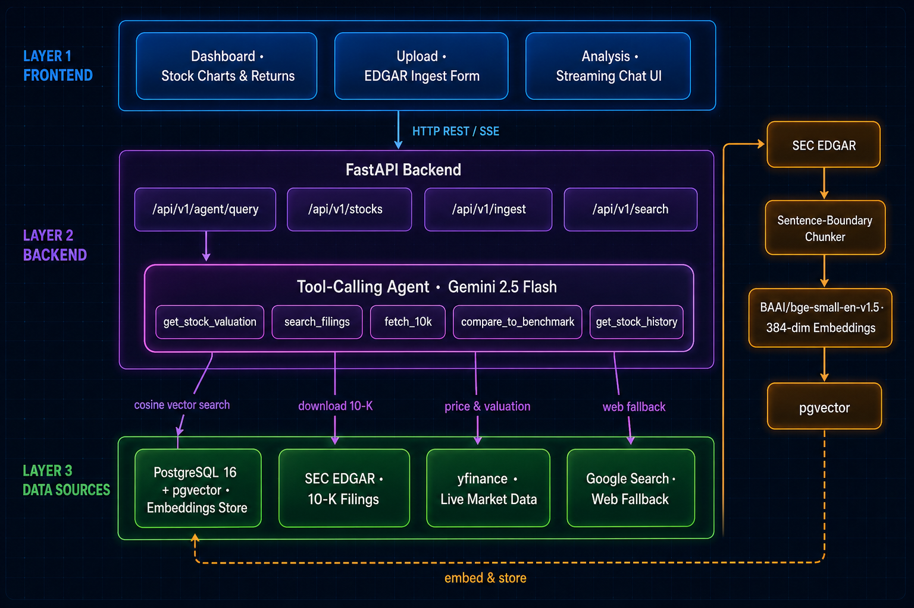

# Financial AI Agent

A full-stack financial research assistant that ingests SEC 10-K filings, answers questions using a RAG pipeline, and delivers buy/hold/sell recommendations grounded in live market data — with automatic web search fallback when filing data is insufficient.

---

## Architecture

 

### Agent Request Flow

```
                        ┌──────────────────────┐
                        │     User Question    │
                        └──────────┬───────────┘
                                   │
                                   ▼
                        ┌──────────────────────┐
                        │  Extract ticker+year │
                        │  Gemini JSON extract │
                        └──────────┬───────────┘
                                   │
                                   ▼
                        ┌──────────────────────┐
                        │    search_filings    │
                        │  ticker + year filter│
                        └──────────┬───────────┘
                                   │
                     ┌─────────────┴─────────────┐
                chunks found                   empty
                     │                             │
                     ▼                             ▼
          ┌──────────────────┐        ┌────────────────────────┐
          │ get_stock_       │        │       fetch_10k        │
          │ valuation +      │        │  Download from EDGAR   │
          │ compare_to_      │        │  Embed into pgvector   │
          │ benchmark        │        └───────────┬────────────┘
          └────────┬─────────┘                    │
                   │                              ▼
                   │                   ┌──────────────────────┐
                   │                   │  retry search_filings│
                   │                   └──────────┬───────────┘
                   │                              │
                   │              ┌───────────────┴────────────┐
                   │        chunks found                   still empty
                   │              │                             │
                   │◄─────────────┘                             ▼
                   │                               ┌─────────────────────┐
                   ▼                               │    google_search    │
          ┌──────────────────┐                     │     Web fallback    │
          │  Gemini synthesis│                     └──────────┬──────────┘
          └────────┬─────────┘                                │
                   │                                          │
       ┌───────────┴──────────┐                               │
  sufficient             NEEDS_WEB_SEARCH                     │
       │                      └─────────────────────────────  ┘
       ▼                                                      │
┌─────────────────────────┐                                   │
│   Structured Answer  or │◄─────────────────────────────────┘
│  BUY / HOLD / SELL table│
└─────────────────────────┘
```

---

## Features

| Feature | Description |
|---|---|
| **SEC EDGAR Ingestion** | Auto-downloads 10-K filings (PDF preferred, HTML fallback) directly from SEC |
| **Auto-ingest on demand** | If a filing isn't in the DB, the agent downloads and embeds it automatically before answering |
| **RAG pipeline** | Sentence-boundary chunking → BAAI/bge-small-en-v1.5 embeddings → pgvector cosine search |
| **Buy / Hold / Sell** | Structured recommendation table combining live valuation, 10-K fundamentals, and benchmark alpha |
| **Live stock data** | Price history, returns, P/E, P/B, 52-week range, analyst targets via yfinance |
| **Web search fallback** | Gemini `google_search` fires automatically when filing data can't answer the question |
| **Streaming chat** | Server-Sent Events (SSE) stream tool calls, tool results, and the final answer in real time |
| **Persistent chat** | Conversation history saved to `localStorage`; survives tab switches |
| **MCP server** | Claude Desktop integration via FastMCP (`mcp_servers/edgar_server.py`) |

---

## Prerequisites

- **Docker & Docker Compose** — for the database (recommended path)
- **Python 3.11+** and a virtual environment — for the API
- **Node.js 18+** — for the React frontend
- **Gemini API key** — [get one free at Google AI Studio](https://aistudio.google.com/)

---

## Setup

### 1. Clone and create environment file

```bash
git clone <repo-url>
cd ai-finance
cp .env.example .env
```

Open `.env` and set your Gemini key:

```env
GEMINI_API_KEY=your_key_here
```

All other defaults work out of the box with Docker.

---

### 2. Start the database

```bash
docker-compose up db -d
```

This starts PostgreSQL 16 with the `pgvector` extension on port `5432`.

---

### 3. Start the API

```bash
# Create and activate virtual environment
python -m venv venv
venv\Scripts\activate        # Windows
# source venv/bin/activate   # macOS / Linux

pip install -r requirements.txt

python -m uvicorn app.main:app --reload --port 8001
```

The API will be available at `http://localhost:8001`.  
Health check: `curl http://localhost:8001/health`

---

### 4. Start the frontend

```bash
cd frontend
npm install
npm run dev
```

Open `http://localhost:5173` in your browser.

---

### 5. (Optional) Full Docker stack

To run everything in containers:

```bash
docker-compose up --build
```

This starts both the API (port 8000) and the database. You still need to run the frontend separately with `npm run dev`.

---

## Usage Guide

### Upload / Ingest a 10-K

1. Navigate to the **Upload** tab
2. Enter a ticker symbol (e.g. `AAPL`) and a fiscal year (e.g. `2024`)
3. Click **Download from EDGAR** — the filing is fetched from SEC, chunked, embedded, and stored

The agent can also **auto-ingest on demand**: if you ask about a company/year not yet in the database, it downloads and embeds the filing automatically before answering.

---

### Ask Questions (Analysis tab)

Type any financial question in the chat. Examples:

```
What was Apple's revenue in 2024?
Did Google outperform the market in 2022?
Should I buy Microsoft stock?
What are the key risk factors for Tesla?
What is the latest news about Nvidia?
```

The agent will:
- Show each tool it calls (yellow cards — expand to see arguments)
- Show tool results (green cards — expand to see raw data)
- Stream the final answer with a collapsible **Sources** panel citing the 10-K passages used

---

### Buy / Hold / Sell Recommendation

Ask any investment question:

```
Is Apple a good buy right now?
Give me a buy/hold/sell recommendation for MSFT.
Should I invest in Amazon stock?
```

The agent returns a structured table:

| Factor | Signal | Detail |
|---|---|---|
| Valuation (P/E) | Fair / Cheap / Expensive | forward P/E vs history |
| Price vs 52-week range | Near low / Mid / Near high | % from 52w high |
| Analyst consensus | Buy / Hold / Sell | mean target + upside % |
| Revenue growth | Positive / Flat / Negative | % YoY from 10-K |
| Market performance | Outperform / Underperform | alpha vs S&P 500 |

Followed by a rationale, key risks from the 10-K, and a disclaimer.

---

### Stock Dashboard

The **Dashboard** tab shows:
- Interactive OHLCV price chart for any ticker
- Total return % over a date range
- Alpha vs S&P 500 (SPY benchmark)

---

## API Reference

| Method | Endpoint | Description |
|---|---|---|
| `GET` | `/health` | Health check |
| `POST` | `/api/v1/agent/query` | Streaming SSE agent (main chat endpoint) |
| `POST` | `/api/v1/ingest/download` | Download + ingest a 10-K from EDGAR |
| `GET` | `/api/v1/ingest/progress/{id}` | Poll ingestion progress |
| `GET` | `/api/v1/ingest/document/{id}` | View ingested document |
| `DELETE` | `/api/v1/ingest/delete/all` | Wipe all ingested documents |
| `GET` | `/api/v1/search/` | Vector similarity search over chunks |
| `GET` | `/api/v1/stocks/history` | OHLCV price history |
| `GET` | `/api/v1/stocks/metrics` | Return % and benchmark alpha |

---

## Environment Variables

| Variable | Default | Description |
|---|---|---|
| `DATABASE_URL` | `postgresql+asyncpg://...@db:5432/financial_db` | asyncpg connection string |
| `GEMINI_API_KEY` | *(required)* | Google Generative AI key |
| `GEMINI_MODEL` | `gemini-2.5-flash` | Gemini model for agent and extraction |
| `EMBEDDING_MODEL` | `BAAI/bge-small-en-v1.5` | Sentence-transformers model |
| `EMBEDDING_DIMENSION` | `384` | Vector dimension (must match model) |
| `CHUNK_SIZE` | `512` | Max tokens per document chunk |
| `CHUNK_OVERLAP` | `50` | Overlap between consecutive chunks |

---

## Module Layout

```
app/
  main.py                     FastAPI app, router registration
  core/config.py              Pydantic-settings from .env
  db/
    models.py                 ORM models: Company, Document, DocumentChunk, StockPrice
    session.py                Async SQLAlchemy session factory + DB init
  api/
    agent.py                  SSE streaming agent endpoint
    ingestion.py              EDGAR download, progress polling, document viewer
    search.py                 Vector similarity search
    stocks.py                 Stock price history & metrics
  services/
    agent_service.py          Tool-calling agent loop (Gemini) with web search fallback
    langgraph_agent.py        LangGraph RAG pipeline (filing search + auto-ingest)
    embeddings.py             BAAI/bge-small-en-v1.5 model loader (384-dim)
    document_processor.py     Sentence-boundary chunking + embedding storage
    edgar_service.py          SEC EDGAR CIK lookup, filing discovery, PDF/HTML download
    stock_service.py          yfinance OHLCV + valuation metrics + benchmark alpha
  tools/
    definitions.py            Gemini tool function schemas
    executors.py              Tool execution logic (search, ingest, stock data)

frontend/src/
  App.jsx                     React Router, navbar
  pages/
    Dashboard.jsx             Stock chart + return metrics
    Upload.jsx                EDGAR download form + PDF viewer
    Analysis.jsx              Chat with streaming agent
  components/
    ChatInterface.jsx         SSE chat UI, tool cards, source panel, localStorage persistence
    DocumentUpload.jsx        Form, live progress log, PDF viewer
    StockChart.jsx            OHLCV price chart
    CompanySelector.jsx       Ticker + date picker

mcp_servers/
  edgar_server.py             FastMCP server exposing EDGAR tools to Claude Desktop
```

---

## Reset the Database

```bash
docker-compose down -v
docker-compose up db -d
```

This wipes all ingested documents and embeddings.

---

## MCP Integration (Claude Desktop)

`mcp_servers/edgar_server.py` exposes three tools to Claude Desktop:

- `list_10k_filings(ticker)` — available filing years for a company
- `get_filing_metadata(ticker, year)` — accession number and URL
- `download_10k(ticker, year)` — full text content of the filing

Add it to your Claude Desktop `claude_desktop_config.json` to query 10-K filings directly from Claude.
